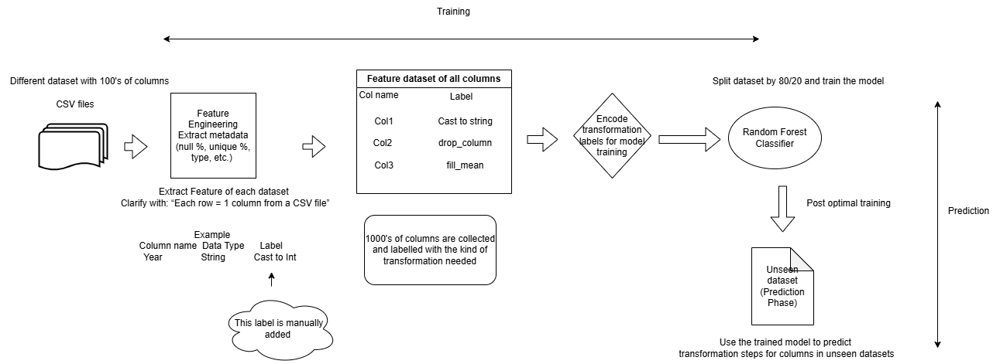

# ETLAutomation

## Smart Column Transformation Recommender (ETL Assistant)
This project uses machine learning to automatically suggest transformation rules for individual columns in CSV datasets. It is built to support data preprocessing in ETL pipelines, especially for datasets with hundreds of columns and varied data types.

## 🔍 How it works:
Feature Engineering: Metadata (e.g., data type, null %, uniqueness) is extracted from each column in multiple CSV files.

Manual Labeling: Each column is labeled with the transformation it needs (e.g., cast_to_string, drop_column, fill_mean).

Model Training: A Random Forest classifier is trained on the labeled feature dataset to learn transformation patterns.

Prediction Phase: The trained model is used to automatically recommend transformation steps for columns in unseen datasets.

## ✅ Key Benefits:
Reduces manual effort in ETL preprocessing.

Adapts across diverse datasets and schema structures.

Easy to extend with more transformations or advanced models.
